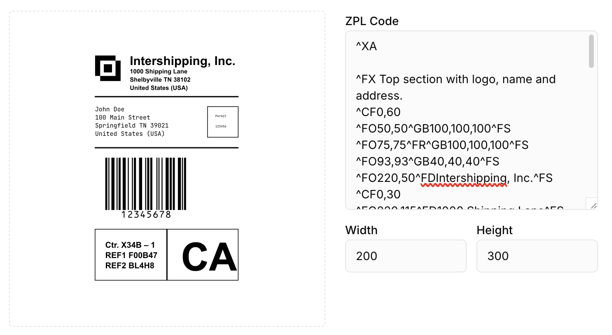

# react-zpl-renderer

Render ZPL label codes as canvas.

This builds on top of the amazing [zpl-js](https://github.com/tomoeste/zpl-js) library and offers a simplified component to just get raw ZPL code rendered onto your page. This repacks and internalizes `zpl-js` to simplify the usage even further.

## Installation

```bash
npm install react-zpl-renderer
# or
yarn add react-zpl-renderer
```

## Usage

```tsx
import ZplRenderer from 'react-zpl-renderer';

function MyComponent() {
  const zplCode = `
    ^XA
    ^FO20,20^A0N,25,25^FDHello World^FS
    ^XZ
  `;

  return <ZplRenderer zpl={zplCode} width={400} height={600} />;
}
```

## Props

- `zpl` (string): The ZPL code to render
- `width` (number): Canvas width in pixels (default: 400)
- `height` (number): Canvas height in pixels (default: 600)
- `data-component` (string): Data attribute for testing (default: "ZplRenderer")
- All other canvas HTML attributes are supported

## Next.js Usage

This library works with Next.js out of the box. For canvas-based components like this one, it's recommended to disable SSR:

```tsx
import dynamic from 'next/dynamic';

const ZplRenderer = dynamic(() => import('react-zpl-renderer'), {
  ssr: false,
});

function MyComponent() {
  const zplCode = `
    ^XA
    ^FO20,20^A0N,25,25^FDHello World^FS
    ^XZ
  `;

  return <ZplRenderer zpl={zplCode} width={400} height={600} />;
}
```

## Demo


